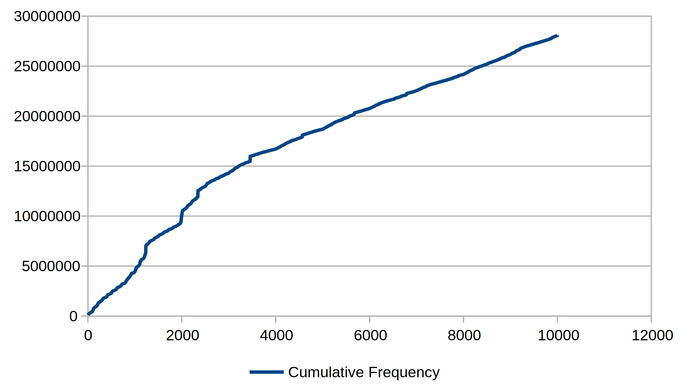
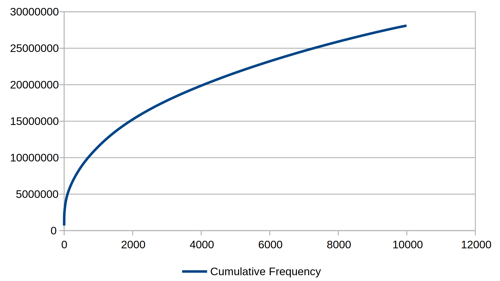

# RockYou PIN Bank
Numeric PINs counted and sorted by frequency as they occur in the RockYou dataset.

## Overview
This repository contains a bank of consecutive runs of 1, 2, 3, 4, 5 and 6 numbers captured from the RockYou dataset which have potential use in approximating the popularity of PIN numbers of these lengths. For example, the cumulative frequency chart when we take each 4-digit PIN in ascending order (that is, from `0000` to `9999`) looks like this:

Whereas, if we take each PIN when sorted by frequency (most frequent first) we get the following:

This data was harvested using the PIN harvester utility bundled with [JumpMapper](https://github.com/sr-lab/jump-mapper).

## Application
When it comes to PIN guessing/brute-forcing attacks this data could be potentially useful, particularly when evaluating the resilience of systems to these attacks.

## Acknowledgements
This work was inspired by the [DataGenetics article here](http://www.datagenetics.com/blog/september32012/) and [this work](http://jemore.free.fr/wordpress/?p=73&t=most-common-pin-numbers-complete-list), which reverse-engineers relative PIN frequency from the image provided in the first article.
